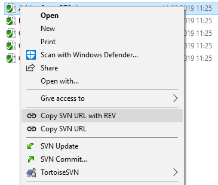
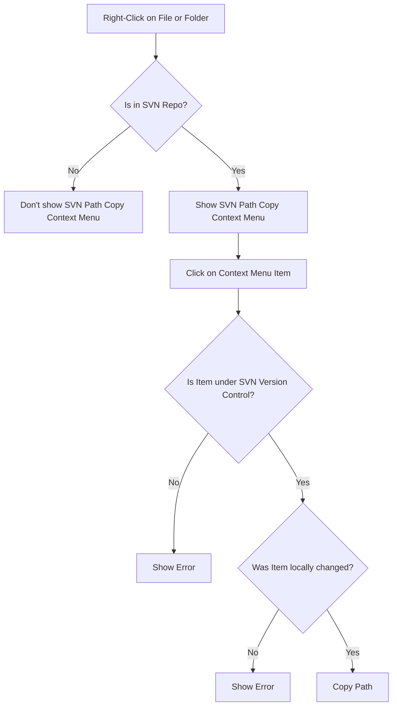

# SVN Path Copy

Adds an context menu entry to copy the url of an SVN file or folder with the last change revision number (?p=number).
> For Example: https://your-svn.org/your-repo/file.txt?p=2



## Flowchart


## Developing

SVN Path Copy is currently developed in Visual Studio 2017.

### Dependecies

 - [SharpShell](https://github.com/dwmkerr/sharpshell)
 - [SharpSVN](https://sharpsvn.open.collab.net/)

### Building

If all dependencies are installed you can build SVN Path Copy in Visual Studios.
Open the main project `./SVNPathCopy/SVNPathCopy.sln` and you should be able to build it.

### Debugging
```bash
.\ServerRegistrationManager.exe uninstall "..\SvnPathCopy.SharpShell\bin\Release\net8.0-windows\SvnPathCopy.SharpShell.dll"
.\ServerRegistrationManager.exe config LoggingMode File
.\ServerRegistrationManager.exe config LogPath log.txt
.\ServerRegistrationManager.exe install "..\SvnPathCopy.SharpShell\bin\Release\net8.0-windows\SvnPathCopy.SharpShell.dll" -codebase

regsvr32 /s "SvnPathCopy.SharpShell\bin\Release\net8.0-windows\SvnPathCopy.SharpShell.dll"
regsvr32 /u /s "SvnPathCopy.SharpShell\bin\Release\net8.0-windows\SvnPathCopy.SharpShell.dll"

taskkill /f /im explorer.exe
start explorer.exe
```

## Licensing

SVNPathCopy is under the GPL-3.0 License - the details are at [LICENSE.md](https://raw.githubusercontent.com/clFaster/SVNPathCopy/master/LICENSE)
